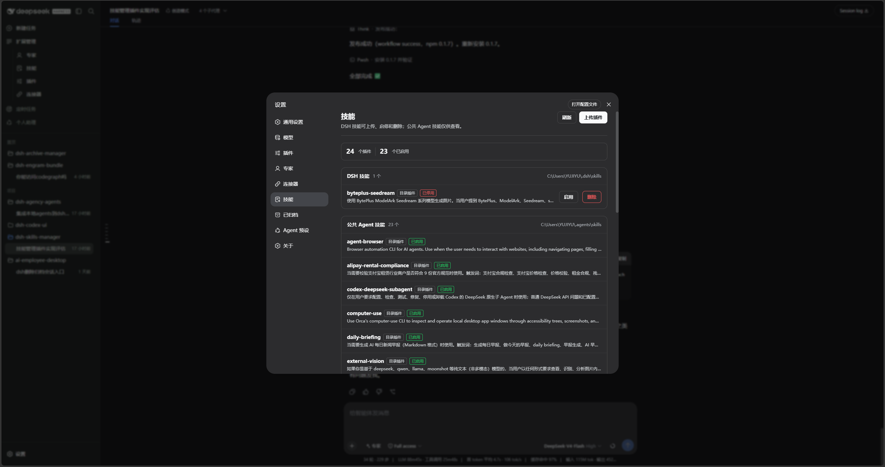

<p align="center">
  
</p>

<h1 align="center">DSH Skills Manager</h1>

<p align="center">
  <strong>A DeepSeek Harness Web plugin for safely managing local skills and viewing shared Agent skills.</strong>
</p>

<p align="center">
  <a href="https://github.com/MichengAI/dsh-skills-manager/issues">Report an issue</a>
  · <a href="https://www.npmjs.com/package/@michengai/dsh-skills-manager">View on npm</a>
  · <a href="README.zh-CN.md">简体中文</a>
</p>

> DSH Skills Manager is a community-maintained plugin, not an official DeepSeek AI product.

## Features

- Shows local `$DSH_HOME\skills` and shared `$DSH_AGENTS_HOME\skills` in one Settings page.
- Enables, disables, uploads, replaces, and deletes DSH-local skills.
- Keeps shared Agent skills strictly read-only and never changes their global metadata.
- Imports a plugin directory containing `SKILL.md` through the native file picker and confirms every name collision.
- Rejects traversal names, imports from the DSH skills directory itself, and symbolic links.



## Prerequisites

- A working DeepSeek Harness Web installation with `dsh` available in PowerShell.
- Examples use the `web` profile; replace it with the target profile.
- Source installation and development require Node.js 20+. npm installation does not require running `npm install` in an arbitrary directory.

## Installation

### Install from npm

Run this from any PowerShell directory. Install into the DSH profile through `dsh plugin`:

```powershell
[Console]::OutputEncoding = [System.Text.Encoding]::UTF8
$OutputEncoding = [System.Text.Encoding]::UTF8
dsh plugin --profile web add @michengai/dsh-skills-manager
dsh --profile web --dump-config
```

Restart DSH Web or reload the active Web profile. If a package mirror is behind, append `--registry=https://registry.npmjs.org/`.

### Install from source

Use this for debugging or unpublished changes. The cloned directory becomes the plugin source path:

```powershell
[Console]::OutputEncoding = [System.Text.Encoding]::UTF8
$OutputEncoding = [System.Text.Encoding]::UTF8
Set-Location D:\Repository\deepseek-harness-plugin
git clone https://github.com/MichengAI/dsh-skills-manager.git
Set-Location .\dsh-skills-manager
npm install
npm test
dsh plugin --profile web add .
dsh --profile web --dump-config
```

Restart DSH Web or reload the active Web profile. Local installation reads and applies `cordis.patch.yml`; do not copy `lib` files manually.

## Usage

Open **Settings → Skills**, then use the panel as follows:

| Goal | Action | Scope |
| --- | --- | --- |
| Inspect a skill | Review its name, form, description, and invocation state. | DSH and shared Agent skills |
| Enable or disable | Select **Enable** or **Disable**; this controls model invocation and the `/` command. | DSH-local skills only |
| Upload a plugin | Select **Upload Plugin**, then choose the plugin directory’s `SKILL.md`. Its scripts and resources are copied too. | DSH-local skills only |
| Choose the directory | If the selected file has no usable path, choose the directory containing `SKILL.md`. | DSH-local skills only |
| Replace or delete | Confirm a name collision, or select **Delete** for an unneeded local skill. | DSH-local skills only |
| Inspect shared skills | Review shared Agent skills without changing their metadata. | Read-only |

Escape closes only the frontmost upload or confirmation dialog and leaves Settings open.

## Permissions and safety limits

| Directory | View | Enable or disable | Upload or replace | Delete |
| --- | --- | --- | --- | --- |
| `$DSH_HOME\skills` | Yes | Yes | Yes | Yes |
| `$DSH_AGENTS_HOME\skills` | Yes | No | No | No |

- Enable, disable, and delete accept only one ordinary skill-name path segment.
- Replacements copy to a temporary sibling path first and keep the original until that succeeds.
- Write endpoints require JSON and the DSH client request marker, so cross-site browser requests cannot trigger local file operations.

## Secondary development

This repository has no `src` directory. `lib` is directly maintained runtime source, which is its current layout rather than the recommended layout for new plugins. New plugins should prefer `src` built to `lib`.

- [lib\index.js](lib/index.js): host service and local skill file operations.
- [lib\client.js](lib/client.js): Settings page, upload, and confirmation interactions.
- `test\core-test.mjs`: file-operation, permission, and import boundary tests.
- `test\locale-test.mjs`: UI locale tests.

After changing the runtime source, test, inspect package contents, and install from the local directory:

```powershell
[Console]::OutputEncoding = [System.Text.Encoding]::UTF8
$OutputEncoding = [System.Text.Encoding]::UTF8
npm test
npm run pack:check
dsh plugin --profile web add .
```

Preserve path validation, temporary-copy replacement, and shared-skill read-only behavior when changing file-mutation code.

## Validation

```powershell
[Console]::OutputEncoding = [System.Text.Encoding]::UTF8
$OutputEncoding = [System.Text.Encoding]::UTF8
npm test
npm run pack:check
```

`prepublishOnly` runs the core tests before publishing.

## Documentation and license

Project status, usage boundaries, architecture, and iteration records begin at the [documentation entry point](docs/00-交接入口/00-阅读导航.md). The detailed operational guide is `docs\02-产品与业务\01-使用说明.md`.

Licensed under [Apache License 2.0](LICENSE).
