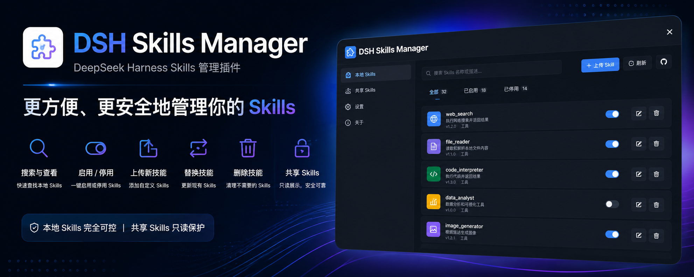

<p align="center">
  
</p>

<div align="center">

  # DSH Skills Manager

  **在 DeepSeek Harness 中统一加载并安全管理本机 Agent Skills**

  [English](README.md) · [更新日志](CHANGELOG.zh-CN.md) · [Apache-2.0](LICENSE)

  [](LICENSE)
  [](https://www.npmjs.com/package/@michengai/dsh-skills-manager)
  [](https://www.npmjs.com/package/@michengai/dsh-skills-manager)
  [](https://github.com/MichengAI/dsh-skills-manager)
  [](https://nodejs.org/)
</div>

> DSH Skills Manager 是社区维护的 DeepSeek Harness（DSH）插件，并非 DeepSeek AI 官方产品。


## 功能概览

把散落在本机和项目中的 Agent 技能集中到 DSH 管理。在同一个页面里查找技能、查看内容、控制启停，也能创建或导入自己的技能。

- **复用已有技能**：发现 `.agents`、CC Switch、Codex、Claude、Gemini、OpenCode 和 Cursor 的用户级技能。
- **按项目整理**：展示活动项目中的 DSH 与 `.agents` 技能，按来源搜索和筛选。
- **切换启停**：只改变 DSH 中的调用策略，不改动来源技能文件。
- **查看技能内容**：阅读正文、来源信息、格式诊断和重名提示。
- **添加自己的技能**：在设置页创建用户级或项目级技能，或导入 ZIP、技能文件夹及 `SKILL.md`。
- **找回误删的技能**：DSH 技能删除后先进入回收站，可恢复到原位置。

## 界面预览

在「设置 → 技能」中按来源管理 DSH 与其他本机 Agent 的技能，启停不会改动来源技能文件：


打开任意技能可查看来源路径、诊断结果、Markdown 正文与解析后的 frontmatter：


DSH 本地技能移入回收站前需要确认；永久删除前仍可恢复：


## DSH 产品生态

想直接使用完整工作台，可下载 [DSH Codex Desktop](https://github.com/MichengAI/dsh-codex-desktop/releases)；已有 [DeepSeek Harness](https://github.com/deepseek-ai/deepseek-harness) 环境，可按需独立安装以下 8 个自研插件。桌面端已随附这些插件。

| 插件 | 你可以用它做什么 |
| --- | --- |
| [Codex UI](https://github.com/MichengAI/dsh-codex-ui) | 整理项目与会话、搜索任务、跳转对话轮次 |
| [IM Connect](https://github.com/MichengAI/dsh-im-connect) | 从微信、飞书、钉钉等消息平台下任务、收回复 |
| [Automation](https://github.com/MichengAI/dsh-automation) | 按计划执行任务，查看每次运行的结果 |
| [Skills Manager](https://github.com/MichengAI/dsh-skills-manager) | 统一查找、启停、创建和导入本机技能 |
| [Archive Manager](https://github.com/MichengAI/dsh-archive-manager) | 搜索、恢复或清理已归档会话 |
| [Agency Agents](https://github.com/MichengAI/dsh-agency-agents) | 按任务选择并召唤专业角色 |
| [BTW](https://github.com/MichengAI/dsh-btw) | 在当前上下文中临时旁问，不打断主任务 |
| [Simplify](https://github.com/MichengAI/dsh-simplify) | 用 /simplify 整理 Git 改动范围内的代码 |

## 前置条件

- 已可正常运行 DeepSeek Harness Web，且可在 PowerShell 中使用 `dsh`。
- 以下示例使用 `web` profile；请替换为实际目标 profile。
- `0.1.46` 已验证兼容 DeepSeek Harness `0.1.0-rc.8`、`0.1.1-rc.2`、`0.1.2-rc.1`、`0.1.5-rc.1`；开发依赖固定使用 `0.1.5-rc.1`，不自动声明支持其他版本。
- 从源码安装或二次开发需要 Node.js `^22.19.0 || >=24.0.0`；仅从 npm 安装无需在任意目录执行 `npm install`。

## 安装

以下安装命令使用官方 npm 源。

### 让 Agent 帮你安装（推荐）

把下面这段话发给任意能够执行本机终端命令的 Agent。将 `web` 替换为实际使用的 profile；安装完成后，在 DSH 中使用本插件。

```text
请将 DSH 插件 @michengai/dsh-skills-manager 安装到本机 web profile，执行：dsh plugin --profile web add @michengai/dsh-skills-manager@latest --registry=https://registry.npmjs.org/。安装后执行 dsh --profile web --dump-config，确认配置包含 skills-manager，并告诉我如何重新加载 DSH 和开始使用。
```

### 从官方 npm 安装最新版

在任意 PowerShell 目录执行：

```powershell
[Console]::OutputEncoding = [System.Text.Encoding]::UTF8
$OutputEncoding = [System.Text.Encoding]::UTF8
dsh plugin --profile web add @michengai/dsh-skills-manager@latest --registry=https://registry.npmjs.org/
dsh --profile web --dump-config
```

需要钉死某一版时，把 `@latest` 换成具体版本，例如 `@0.1.25`。

配置输出中应包含 `skills-manager`。安装后重启 DSH Web 并在浏览器硬刷新。不要手工复制客户端文件，`dsh plugin add` 会同时应用 `cordis.patch.yml`。

## 在线更新

设置标题会显示当前版本和“检查更新”按钮。发现新版后，只有检测到 DSH CLI 或 Desktop 更新服务时才可使用“自动更新”；其他环境会在弹窗中提供可复制、与当前 Profile 对应的手工更新命令。

## 使用

打开「设置 → 技能」，再按下表操作：

| 目标 | 操作 | 范围 |
| --- | --- | --- |
| 搜索或筛选 | 按来源、名称或简介收窄列表。 | 全部来源 |
| 查看详情与诊断 | 查看正文、frontmatter、源文件路径、格式问题和重名遮蔽。 | 全部来源 |
| 启用或停用 | 只更新 manager 本地调用策略，不修改来源 Skill 文件。 | 全部用户级来源与活动项目来源中的有效 Skill |
| 创建或导入 | 在设置页创建时选择用户 DSH 或活动项目 DSH；导入仍为用户级。 | `$DSH_HOME\skills`，创建可选活动 `<project>/.dsh/skills` |
| 从对话创建 | 让 Agent 调用 `create_skill`；写入前由 DSH 审批界面确认。 | `$DSH_HOME\skills` |
| 删除与恢复 | 删除先进入回收站；可恢复到原来源或永久二次删除。 | 用户级与活动项目级 DSH Skill |

> 任何来源的启停都不会修改 Skill 文件；只有用户级或项目级 DSH Skill 可以移入回收站。

按 ESC 只关闭最上层上传框或确认框，设置页会保持打开。

## 权限与安全边界

| 目录 | 查看/加载 | 启用或停用 | 创建/导入 | 删除 |
| --- | --- | --- | --- | --- |
| `$DSH_HOME\skills` | 支持 | 仅写 manager 状态 | 支持 | 进入回收站 |
| `$DSH_AGENTS_HOME\skills` | 支持 | 仅写 manager 状态 | 不支持 | 不支持 |
| `~\.cc-switch\skills` | 支持，默认开启 | 仅写 manager 状态 | 不支持 | 不支持 |
| `%USERPROFILE%\.cursor\skills`（或 `$DSH_CURSOR_HOME\skills`） | 支持 | 仅写 manager 状态 | 不支持 | 不支持 |
| `~/.codex/skills`、`~/.claude/skills`、`~/.gemini/skills`、`~/.config/opencode/skills` | 支持 | 仅写 manager 状态 | 不支持 | 不支持 |
| `<project>/.dsh/skills` | 支持活动 Session 工作区 | 仅写 manager 状态 | 设置页支持创建 | 进入回收站并恢复到原项目 |
| `<project>/.agents/skills` | 支持活动 Session 工作区 | 仅写 manager 状态 | 不支持 | 不支持 |

- 启用、停用和删除只接受单个普通技能名称，目录穿越名称会被拒绝。
- 项目根只从活动 Session 的 `cwd` 推导；客户端只提交不透明来源 key，不能指定任意工作区路径。
- 项目来源遵循 DSH 最近 `.git` 项目根和固定优先级（`project-dsh` 100、`project-agents` 200）。管理器每次读取状态或详情时重新扫描；显式项目策略通过 workspace 作用域 rank 99/199 覆盖候选执行，用户 DSH 策略使用 rank 399；没有覆盖时仍由 DSH 官方 provider 负责。启停只写 manager 状态，项目文件写入仅发生在用户明确执行 `.dsh/skills` 创建、回收或恢复时。
- 当项目与 `$DSH_HOME` 位于不同磁盘时，回收站会降级为“复制后在源盘原子隐藏”；恢复使用反向的同一安全流程。
- 项目回收站条目保存原始不透明来源身份。仅当原项目仍由活动 Session 工作区提供时才允许恢复；客户端不能指定替代路径。
- 项目写入会拒绝链接形式的 `.dsh` 或 `.dsh/skills` 目录，避免仓库把创建、删除或恢复重定向到项目根之外。
- 用户级只读来源与项目 Agent 来源默认递归发现 `SKILL.md`，允许技能目录、技能根及其父目录通过软链接或 Windows junction 指向外部目录，无需开关或目录白名单；按真实路径去重，启停只写 manager 状态。忽略 `SKILL.md` 文件链接，限制扫描深度和数量并终止循环；可写 DSH 与导入、删除仍保留原有边界。
- 普通技能目录发现 `SKILL.md` 后作为 bundle 叶子，不再扫描内部资源，并跳过 `node_modules`；扫描根自身的 `SKILL.md` 仍可与嵌套技能并存。项目 Agent 根与用户技能根真实路径重叠时隐藏，避免绕过用户停用策略。
- 列表和摘要统一使用“已启用/已停用”，不再使用“已加载”：这里描述的是调用策略，完整 Skill 正文仍由 DSH 按需加载。IDE、Git 或 shell 改动后可点击“刷新”；项目 catalog 的 watcher 与 invalidation 仍由官方 provider 负责。
- 没有 Skill 的项目根不会出现在主来源列表中，但仍保留在“创建技能”的目标选择中，确保可以创建第一个项目 Skill。项目 DSH 只提供逐 Skill 启停，不提供整个项目来源总开关。
- 覆盖前先复制到同目录临时路径；复制成功前不会改动现有技能。
- 全部接口（含 GET `/state`）只接受 loopback `Host`，或 DSH Web runtime 已通过 LAN 绑定和 `--trusted-host` 明确信任的 `host[:port]`；未知 Host 继续返回 403。
- 浏览器请求还必须满足同源 `Origin` 且不能标记为 cross-site；写入接口继续要求 JSON 与 DSH 客户端请求标记。
- 导入接受用户选定的本机路径。Host 信任栅栏用于防 DNS rebinding，不是身份认证；通过反向代理或局域网提供服务时，仍应配置认证、VPN 或网络访问控制。

## 二次开发

### 从源码安装

适用于调试或使用未发布改动。克隆后的本地路径就是插件安装路径：

```powershell
[Console]::OutputEncoding = [System.Text.Encoding]::UTF8
$OutputEncoding = [System.Text.Encoding]::UTF8
Set-Location D:\Repository\deepseek-harness-plugin
git clone https://github.com/MichengAI/dsh-skills-manager.git
Set-Location .\dsh-skills-manager
npm install
npm test
dsh plugin --profile web add .
dsh --profile web --dump-config
```

完成后重启 DSH Web 并硬刷新浏览器。`dsh plugin ... add .` 会读取当前目录的包信息和 `cordis.patch.yml`；不要改为直接复制 `lib` 目录。

运行源码维护在 `src`，`lib` 是由 `npm run build` 生成并随 npm 包发布的产物。请修改 `src`，不要直接修改 `lib`：

- [src\core.js](src/core.js)：文件操作、权限和导入边界核心。
- [src\index.js](src/index.js)：Host 服务与本地技能文件操作入口。
- [src\client.js](src/client.js)：设置页、上传和确认交互。
- [scripts\build.mjs](scripts/build.mjs)：生成 Host 与浏览器端 `lib` 产物。
- `test\core-test.mjs`：文件操作、权限和导入边界测试。
- `test\locale-test.mjs`：界面词条测试。

修改后运行测试、检查发布内容并以本地目录安装验证：

```powershell
[Console]::OutputEncoding = [System.Text.Encoding]::UTF8
$OutputEncoding = [System.Text.Encoding]::UTF8
npm test
npm run verify
dsh plugin --profile web add .
```

修改文件写入逻辑时必须保留路径校验、临时目录复制和公共技能只读限制。

## 验证

```powershell
[Console]::OutputEncoding = [System.Text.Encoding]::UTF8
$OutputEncoding = [System.Text.Encoding]::UTF8
npm test
npm run verify
```

`prepublishOnly` 会在发布前自动执行完整 `verify` 门禁：构建、测试、发布包检查和生成产物同步检查。

## 许可证

本项目采用 [Apache License 2.0](LICENSE)。
