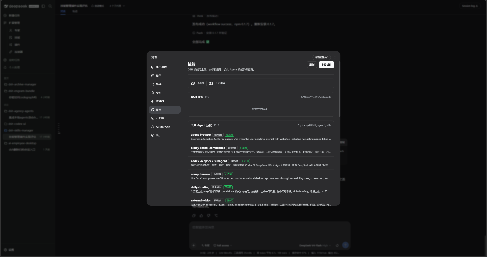
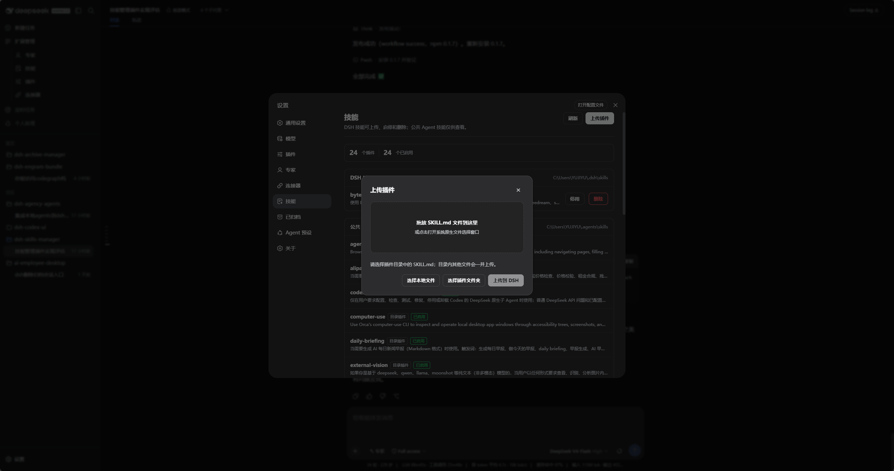
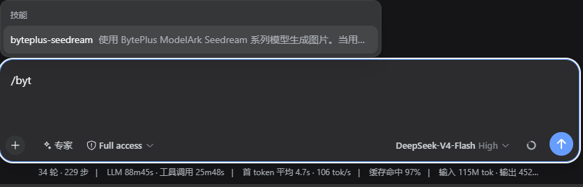

<p align="center">
  
</p>

<h1 align="center">DSH Skills Manager</h1>

<p align="center">
  <strong>安全管理本地技能并查看公共 Agent 技能的 DeepSeek Harness Web 插件。</strong>
</p>

<p align="center">
  <a href="https://github.com/MichengAI/dsh-skills-manager/issues">反馈问题</a>
  · <a href="https://www.npmjs.com/package/@michengai/dsh-skills-manager">在 npm 查看</a>
  · <a href="README.md">English</a>
</p>

<p align="center">
  <a href="LICENSE"></a>
  <a href="https://www.npmjs.com/package/@michengai/dsh-skills-manager"></a>
  
  
</p>

> DSH Skills Manager 是社区维护的插件，并非 DeepSeek AI 官方产品。

<p align="center">
  
</p>

> 截图展示 DSH 本地技能的启用、停用和删除入口。公共 Agent 技能保持只读，不显示操作按钮。

## 功能概览

- 在同一设置页查看本地 `$DSH_HOME\skills` 与公共 `$DSH_AGENTS_HOME\skills`。
- 对 DSH 本地技能执行启用、停用、上传、覆盖和删除。
- 公共 Agent 技能始终只读，不改写共享的全局元数据。
- 使用系统文件选择器导入包含 `SKILL.md` 的插件目录，并对同名覆盖强制确认。
- 拒绝目录穿越、从 DSH 技能目录导入自身及符号链接导入。

## 前置条件

- 已可正常运行 DeepSeek Harness Web，且可在 PowerShell 中使用 `dsh`。
- 以下示例使用 `web` profile；请替换为实际目标 profile。
- 从源码安装或二次开发需要 Node.js 20+；仅从 npm 安装无需在任意目录执行 `npm install`。

## 安装

### 从 npm 安装

在任意 PowerShell 目录执行。请通过 `dsh plugin` 安装到 DSH profile：

```powershell
[Console]::OutputEncoding = [System.Text.Encoding]::UTF8
$OutputEncoding = [System.Text.Encoding]::UTF8
dsh plugin --profile web add @michengai/dsh-skills-manager
dsh --profile web --dump-config
```

安装或升级后重启 DSH Web，或重新加载当前 Web profile。若镜像未同步最新版本，可在安装命令末尾追加 `--registry=https://registry.npmjs.org/`。

### 从源码安装

适用于调试或使用未发布改动。克隆后的目录会直接作为插件安装路径：

```powershell
[Console]::OutputEncoding = [System.Text.Encoding]::UTF8
$OutputEncoding = [System.Text.Encoding]::UTF8
Set-Location D:\Repository\deepseek-harness-plugin
git clone https://github.com/MichengAI/dsh-skills-manager.git
Set-Location .\dsh-skills-manager
npm install
npm test
dsh plugin --profile web add .
dsh --profile web --dump-config
```

完成后重启 DSH Web 或重新加载当前 Web profile。`dsh plugin ... add .` 会自动读取并应用 `cordis.patch.yml`；不要手工复制 `lib` 文件。

## 使用

打开「设置 → 技能」，再按下表操作：

| 目标 | 操作 | 范围 |
| --- | --- | --- |
| 查看技能 | 查看名称、形态、说明和调用状态。 | DSH 与公共 Agent 技能 |
| 启用或停用 | 点击「启用」或「停用」。它会同步控制模型调用和 `/` 手动命令。 | 仅 DSH 本地技能 |
| 上传插件 | 点击「上传插件」，选择插件目录内的 `SKILL.md`。完整目录、脚本和资源都会被复制。 | 仅 DSH 本地技能 |
| 改选插件目录 | 所选文件无可用路径时，选择包含 `SKILL.md` 的目录。 | 仅 DSH 本地技能 |
| 覆盖或删除 | 同名时确认覆盖；使用「删除」移除不再需要的本地技能。 | 仅 DSH 本地技能 |
| 查看公共技能 | 查看公共 Agent 技能，不修改其元数据。 | 只读 |

<p align="center">
  
</p>

> 本地 DSH 技能为空时，公共 Agent 技能仍然可见。

<p align="center">
  
</p>

> 紧凑上传弹窗支持选择 `SKILL.md`、选择插件目录，或直接拖放文件。

<p align="center">
  
</p>

> 删除 DSH 本地技能需要确认，删除后无法恢复。

<p align="center">
  
</p>

> 启用 DSH 本地技能后，聊天输入框会恢复对应的 `/` 命令。

按 ESC 只关闭最上层上传框或确认框，设置页会保持打开。

## 权限与安全边界

| 目录 | 查看 | 启用或停用 | 上传或覆盖 | 删除 |
| --- | --- | --- | --- | --- |
| `$DSH_HOME\skills` | 支持 | 支持 | 支持 | 支持 |
| `$DSH_AGENTS_HOME\skills` | 支持 | 不支持 | 不支持 | 不支持 |

- 启用、停用和删除只接受单个普通技能名称，目录穿越名称会被拒绝。
- 覆盖前先复制到同目录临时路径；复制成功前不会改动现有技能。
- 全部接口（含 GET `/state`）只接受 loopback `Host`（`localhost`、`127.0.0.1`、`[::1]`）。
- 写入接口还要求 JSON 与 DSH 客户端请求标记，跨站浏览器请求不能触发本地文件操作。
- 导入接受用户选定的本机路径。HTTP 接口只信任 loopback 来源，不要把宿主 webServer 暴露到非本机地址。

## 二次开发

当前仓库未提供 `src` 源目录，`lib` 是直接维护的运行源码；这是当前仓库的实现方式，不是新插件的推荐布局。新插件建议使用 `src` 开发并构建到 `lib`：

- [lib\index.js](lib/index.js)：Host 服务与本地技能文件操作入口。
- [lib\client.js](lib/client.js)：设置页、上传和确认交互。
- `test\core-test.mjs`：文件操作、权限和导入边界测试。
- `test\locale-test.mjs`：界面词条测试。

修改后运行测试、检查发布内容并以本地目录安装验证：

```powershell
[Console]::OutputEncoding = [System.Text.Encoding]::UTF8
$OutputEncoding = [System.Text.Encoding]::UTF8
npm test
npm run pack:check
dsh plugin --profile web add .
```

修改文件写入逻辑时必须保留路径校验、临时目录复制和公共技能只读限制。

## 验证

```powershell
[Console]::OutputEncoding = [System.Text.Encoding]::UTF8
$OutputEncoding = [System.Text.Encoding]::UTF8
npm test
npm run pack:check
```

`prepublishOnly` 会在发布前自动执行核心测试。

## 项目文档与许可证

项目状态、使用边界、技术架构和迭代记录从[文档交接入口](docs/00-交接入口/00-阅读导航.md)开始。详细操作说明见 `docs\02-产品与业务\01-使用说明.md`。

本项目采用 [Apache License 2.0](LICENSE)。
