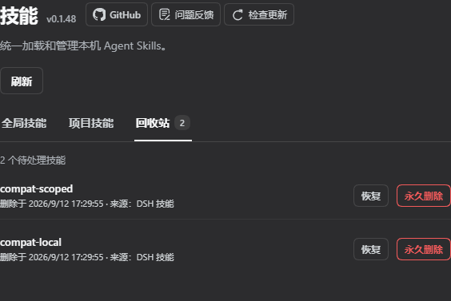

# 使用说明

更新时间：2026-09-01 23:53（Asia/Shanghai）

## 适用范围

本说明面向 DSH Web 的「设置 → 技能」面板使用者。插件统一展示 DSH、公共 Agent、CC Switch、Codex、Claude、Gemini、OpenCode 的用户级 Skills，以及活动 Session 所属 Git 项目的项目级 Skills。

  

> 截图展示「设置 → 技能」面板。可按来源折叠、搜索和筛选；所有来源均可逐 Skill 启停，用户 DSH 与项目 DSH 还可进行对应的创建、导入或回收操作；外部用户来源和项目 Agent 的源文件保持只读。

## 目录权限

| 技能来源 | 可以做什么 | 不可以做什么 |
|---|---|---|
| DSH 技能目录 `$DSH_HOME\skills` | 查看、通过 manager 状态启停、导入、覆盖、移入回收站 | 启停不改写来源文件 |
| 项目 DSH `<project>/.dsh/skills` | 查看、创建、启用、停用、移入回收站并恢复 | 上传导入、覆盖或来源级启停 |
| 项目 Agent `<project>/.agents/skills` | 查看详情、通过管理器本地策略启停 | 创建、导入、覆盖、删除或改写源文件 |
| CC Switch `~\.cc-switch\skills` | 默认开启；查看、通过管理器策略启停 | 导入、覆盖、删除或改写源文件 |
| 公共 Agent、Codex、Claude、Gemini、OpenCode | 查看、通过管理器策略启停 | 导入、覆盖、删除或改写源文件 |

全部来源的逐 Skill 启停状态都写入 `$DSH_HOME\skills-manager\state.json`；不会修改用户 DSH、项目 DSH、项目 Agent 或其他 Agent 的原始 Skill 文件。

CC Switch 选择自身存储时，管理器直接读取 `~\.cc-switch\skills`；选择 `~\.agents\skills` 时由公共 Agent 来源读取。CC Switch 分发到 Codex、Claude 等目录的顶层链接会按真实路径去重，不重复显示同一个技能。

## 常见操作

### 搜索与筛选

摘要条下方可按分类收窄，并按名称、形态或简介即时搜索。无匹配时会出现空结果提示，点击「清除筛选」即可恢复完整列表。公共 Agent 技能仍只读，筛选不会改变权限。

### 启用或停用

所有技能开关都只更新管理器本地状态。停用会同时关闭模型调用和 `/` 手动调用，启用会显式恢复两种入口，即使来源文件原本声明停用或调用字段非法，也不会修复或改写来源文件。

项目 DSH 与项目 Agent 开关都只更新 manager 本地状态：显式策略通过当前 workspace 的 rank 99/199 覆盖候选执行；未设置显式覆盖时由官方 provider 负责，源 `SKILL.md` 始终不变。

### 创建用户或项目 DSH 技能

点击页面右上角「创建技能」，在目标位置选择用户 DSH 或当前活动 Git 项目的项目 DSH，填写名称、简介和正文后创建。项目必须能从活动 Session cwd 找到 `.git` 根；普通目录不会被当作项目。空项目来源不会占据主列表，但仍可在创建目标中选择。

### 查看正文与诊断

点击「查看详情」可检查技能来源路径、诊断结果、Markdown 正文和解析后的 frontmatter。详情为只读展示，不会自动修改外部源文件。

  

### 上传 DSH 技能

1. 点击页面右上角「导入」。
2. 把 `.zip`、技能文件夹或单个 `SKILL.md` 拖到上传区，也可以点击「选择文件夹 / 选择文件」。
3. 确认弹窗内的文件名称、数量与大小，然后点击「安装」。
4. 同名技能默认安全跳过，结果会明确显示导入项与跳过项。

上传会复制整个插件目录，以保留脚本、模板和资源文件。

整个流程只使用一个弹窗和一次原生选择，不要求本机绝对路径，也不会再打开第二个目录选择器。

### 删除用户或项目 DSH 技能

用户 DSH 与项目 DSH 技能都提供「移到回收站」。确认后技能会离开原目录并进入管理器回收站；恢复时返回原来的用户或项目作用域，项目恢复要求该项目仍处于活动 Session。外部用户来源和项目 Agent 来源不提供删除入口。

  

> 移入回收站前会弹出确认框；该步骤可恢复，只有回收站中的「永久删除」才不可恢复。

### 关闭弹窗

按 ESC 只关闭当前最上层弹窗。若存在覆盖或移到回收站确认框，会先关闭确认框，再关闭上传框，设置页保持打开。

## 常见问题

| 现象 | 处理方式 |
|---|---|
| 上传后出现失败提示 | 失败原因会直接显示；批量上传时，成功项会保留，失败项需修复后重新上传。 |
| 选择文件后无内容变化 | 查看上传弹窗内的选择状态或错误提示；文件必须是 `.zip` 或 `SKILL.md`，文件夹内必须包含 `SKILL.md`。 |
| 公共 Agent 技能列表为空 | 确认运行中的 DSH 已加载当前插件版本，并检查 `$DSH_AGENTS_HOME\skills` 是否存在。 |
| CC Switch 技能列表为空 | 确认 CC Switch 的 Skills 存储位置选择了“CC Switch”，并检查 `~\.cc-switch\skills` 是否存在；选择 `~\.agents\skills` 时请查看“公共 Agent”来源。 |
| 仍然显示旧界面 | 重新加载插件并重启 DSH Web profile。 |

